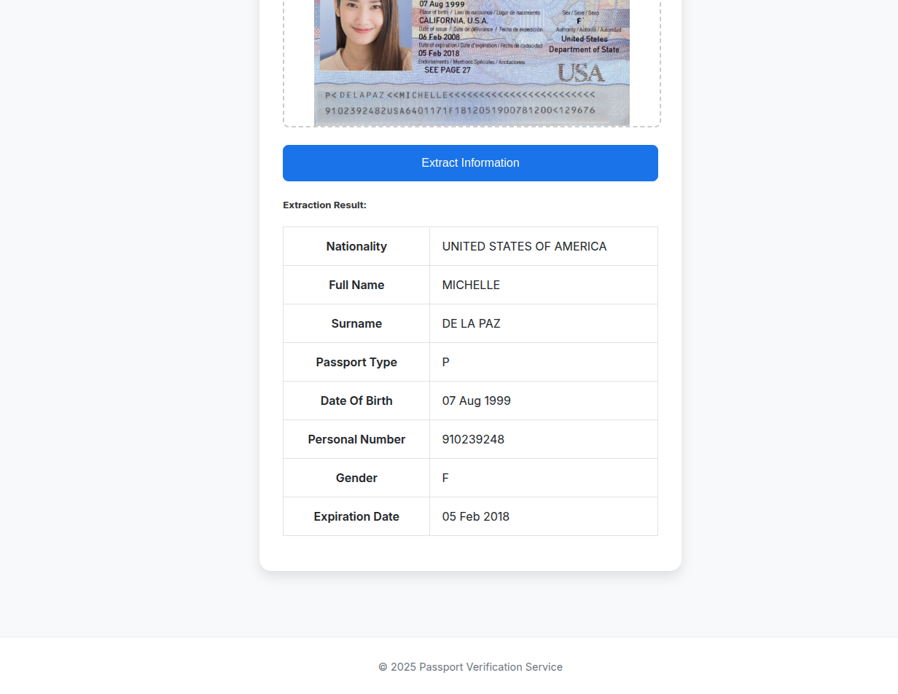
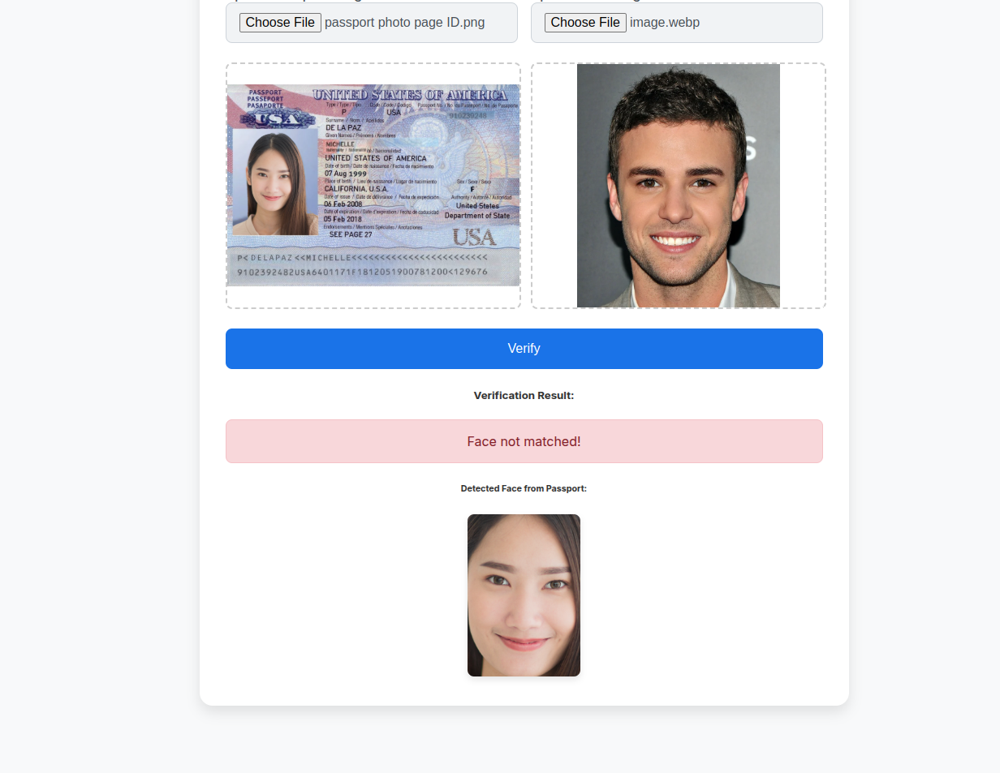

# Passport Verification Service Documentation

This document provides a comprehensive overview of the Passport Verification Service application, including its workflow, deployment process, infrastructure, and the AI models that power it. This documentation is intended for a technical audience, such as a hiring manager at Google.

## 1. Application Workflow

The application is a web-based service that provides two main features:

**Information Extraction**

**Face Verification**
1.  **Passport Information Extraction**: Users can upload an image of a passport, and the application will extract key information from it, such as nationality, full name, date of birth, etc.
<table>
  <tr>
    <td></td>
    <td></td>
  </tr>
</table>

2.  **Passport Verification**: Users can upload an image of a passport and a picture of their own face. The application will then compare the face from the passport with the user's picture to verify their identity.

<table>
  <tr>
    <td></td>
    <td></td>
  </tr>
</table>

The application is built using the following technologies:

*   **FastAPI**: A modern, fast (high-performance) web framework for building APIs with Python 3.7+ based on standard Python type hints.
*   **Jinja2**: A modern and designer-friendly templating language for Python, modelled after Django’s templates.
*   **uv**: A fast Python package installer and resolver, written in Rust.
*   **Mangum**: An adapter for running ASGI applications in AWS Lambda.

The application is structured as follows:

*   `app/main.py`: The main entry point of the application. It contains the FastAPI application and the API endpoints for the two features.
*   `app/ai.py`: This module contains the core AI logic for extracting information from passports and verifying faces.
*   `app/utils.py`: This module contains utility functions used by the application.
*   `app/templates/`: This directory contains the Jinja2 templates for the web interface.
*   `app/static/`: This directory contains the static files, such as CSS and JavaScript.

## 2. AI Workflow

The AI workflow is divided into two parts: information extraction and face verification.

### 2.1. Information Extraction

The information extraction workflow is as follows:

1.  The user uploads a passport image through the web interface.
2.  The `extract_info` function in `app/ai.py` is called.
3.  This function uses the Google Gemini API to extract the information from the passport image.
4.  The extracted information is then returned to the user and displayed on the web page.

The prompt used for information extraction is: `Extract all info from the given passport image`. The output is structured using the `PassportInfo` Pydantic model.

### 2.2. Face Verification

The face verification workflow is as follows:

1.  The user uploads a passport image and a picture of their face.
2.  The `verify_passport` function in `app/ai.py` is called.
3.  This function uses the **Amazon Rekognition** service to compare the faces in the two images.
4.  The `compare_faces` API of Rekognition is used to get a similarity score between the two faces.
5.  If the similarity score is above a certain threshold (90%), the faces are considered a match.
6.  The result of the verification, including the similarity score and the detected face from the passport, is then returned to the user.

## 3. Deployment Workflow

The application is deployed to **AWS Lambda** using a CI/CD pipeline powered by **GitHub Actions**.

The deployment workflow is defined in the `.github/workflows/deploy.yml` file and consists of the following steps:

1.  **Checkout code**: The code is checked out from the repository.
2.  **Configure AWS credentials**: The AWS credentials are configured to allow access to the AWS resources.
3.  **Setup Terraform**: Terraform is set up to manage the infrastructure.
4.  **Terraform Init**: The Terraform working directory is initialized.
5.  **Terraform Apply**: The Terraform configuration is applied to create or update the AWS resources.

The `makefile` contains several useful commands for local development, such as `sync`, `lint`, `fix`, `format`, and `dev`.

## 4. Infrastructure

The infrastructure for this application is managed using **Terraform** and is defined in the `terraform/` directory.

The main components of the infrastructure are:

*   **Amazon ECR (Elastic Container Registry)**: A fully-managed Docker container registry that makes it easy for developers to store, manage, and deploy Docker container images. The application is packaged as a Docker image and stored in ECR.
*   **AWS Lambda**: A serverless compute service that lets you run code without provisioning or managing servers. The application runs as a Lambda function.
*   **Amazon API Gateway**: A fully managed service that makes it easy for developers to create, publish, maintain, monitor, and secure APIs at any scale. API Gateway is used to create an HTTP endpoint for the Lambda function.
*   **AWS IAM (Identity and Access Management)**: A web service that helps you securely control access to AWS resources. IAM is used to create a role for the Lambda function with the necessary permissions to access other AWS services, such as ECR and Rekognition.
*   **Amazon CloudWatch**: A monitoring and observability service from AWS. CloudWatch is used to store the logs of the Lambda function.

The `terraform/main.tf` file contains the definition of all these resources. The infrastructure is created and updated automatically by the CI/CD pipeline.

## 5. Author

This application was developed by [ikram98ai](https://github.com/ikram98ai).
